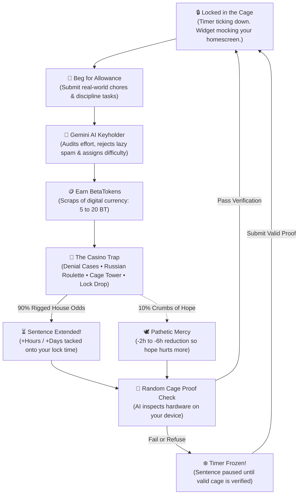

<div align="center">

# 🔒 βetaLocker (ProjectBeta)

### Solo Android Chastity. Rigged Odds. The System is Your Keyholder.

[-3DDC84.svg?logo=android&logoColor=white)](#-getting-started)
[](https://kotlinlang.org/)
[](#-the-features)
[](#-privacy--no-remote-keyholder)
[](#-how-to-feed-it-a-free-gemini-key)
[](LICENSE)

**Yahallo, betas.**

A free, solo chastity app for locked boys who want **the system** to control them — not a real keyholder.  
*(Or you’re just too shy to ask someone on Discord. That’s fine. The app doesn’t care.)*

No monthly subscriptions. No human keyholder ghosting you for weeks. No “trust me bro” honor system that crumbles the second you get horny.

**Just open it. Stay denied.**

<br/>

<div align="center">
  <a href="#-the-evidence-screenshots"><b>Screenshots</b></a> •
  <a href="#-the-trap-what-this-is"><b>The Trap</b></a> •
  <a href="#-the-vicious-cycle-core-loop"><b>The Cycle</b></a> •
  <a href="#-the-features"><b>Features</b></a> •
  <a href="#-the-rigged-casino"><b>The Casino</b></a> •
  <a href="#-how-to-feed-it-a-free-gemini-key"><b>Gemini Key</b></a> •
  <a href="#-build-from-source"><b>Build Guide</b></a>
</div>

</div>

<br/>

---

## 📱 The Evidence (Screenshots)

<div align="center">
  
  &nbsp;
  
  &nbsp;
  
  &nbsp;
  
  <p><i>1. Cold countdown timer ➔ 2. Incorruptible task judge ➔ 3. Ruinous denial gacha ➔ 4. Ambient widget mocking you on your homescreen</i></p>
</div>

---

## ⛓️ The Trap (What This Is)

**betalocker** is a local-first Android chastity manager that explicitly hates you. The odds are rigged, the AI rejects your lazy excuses, and every token you spend will probably add days to your sentence:

| What You Do… | What The System Does… |
| :--- | :--- |
| **Beg for tokens with daily tasks** | Gemini AI audits your chores and smacks down low-effort garbage. |
| **Do actual productive work** | Grants crumbs of **BetaTokens** (strictly once per valid mission). |
| **Gamble your tokens on cases & games** | **Extends your lock sentence** 9 times out of 10. |
| **Turn on random cage proof checks** | **Freezes your timer completely** until you submit photographic proof of the cage. |

*If you cheat outside the app in real life, that’s your problem. The system doesn’t care. Stay locked.*

---

## 🔄 The Vicious Cycle (Core Loop)



> **Tagline:** *Daily discipline, rigged rewards.*

---

## ✨ The Features

### ⏱️ Home — The Cold Countdown
* **Unforgiving Timer**: Tracks your sentence down to the exact second with a calculated unlock target date.
* **Random Cage Proof Check**: Optional AI inspection. If the system demands proof, your countdown **freezes** until you submit a live photo showing your cage is securely on.
* **Privacy Mode**: Too shy or can't take photos at work? Turn proof checks off anytime. You still stay locked, but your timer won't freeze.
* **Ambient Denial Widget**: Sits permanently on your Android home screen tracking **hours denied** so you never forget what you are throughout the day.

### 📝 Tasks — Earn Your Allowance
The system forces you to be a productive member of society if you want to gamble:
* **Incorruptible AI Judge**: Google Gemini reviews every mission prompt. Trying to submit *"drank a glass of water"* or *"breathed air"* gets rejected immediately.
* **The Pay Scale**:
  | Difficulty | BetaTokens Paid | Real-World Expectation |
  | :--- | :--- | :--- |
  | **Easy** | 5 BT | Quick chores, light exercise, 15 min reading |
  | **Medium** | 7 BT | Focused study, structured gym sessions, deep cleaning |
  | **Hard** | 10 BT | Multi-hour projects, strict diet milestones, heavy exams |
  | **Hardcore** | 20 BT | All-day discipline goals, exhausting milestones |

---

## 🎰 The Rigged Casino (Bad Decisions Only)

You worked hard for your BetaTokens. Now watch the system take them all back and lock you longer:

| Machine | Cost | The Trap |
| :--- | :--- | :--- |
| 📦 **Denial Case** | 3 BT | Rarity-weighted lootboxes (Common to Extinction). Pulls sentence extensions almost every time. |
| 🎡 **Roulette** | 5 BT | Spin the wheel of misfortune for instant penalty time. |
| 🗼 **Cage Tower** | 6 BT | Push-your-luck tower climb — one bad step adds days to your sentence. |
| 💧 **Lock Drop** | 5 BT | Pachinko physics dropping your token into penalty slots. |

> **Design Intent:** *Tokens are strictly for bad decisions, not freedom. Mercy exists only so hope hurts more.*

### 🛒 The Mercy Shop — Overpriced Crumbs
For the pathetic few who try to "work their way out" honestly:

| Freedom Purchased | Token Cost | The Reality |
| :--- | :--- | :--- |
| **−2 Hours** | 40 BT | 8 Easy Tasks for 120 minutes of freedom. |
| **−4 Hours** | 80 BT | 16 Easy Tasks of hard labor. |
| **−6 Hours** | 115 BT | 23 Easy Tasks. The math is not your friend. |

---

## 🔑 How to Feed it a Free Gemini Key

Task evaluation and camera proof checks run directly against **Google Gemini Vision**.  
You feed the app your own **free personal API key** from Google AI Studio. No middleman servers, no logging, zero monthly fees.

<div align="center">
  
</div>

### Step-by-Step Setup:

1. **Open Google AI Studio**: Head over to [aistudio.google.com](https://aistudio.google.com/) and sign in.
2. **Create API Key**: Click **Get API key** ➔ **Create API key in new project**.
3. **Copy the Key**: Copy it once and don't share it with anyone.
4. **Feed the App**: Open **betalocker** ➔ **Settings** ➔ **Gemini API Key** ➔ Paste and save.

### Who Controls What:

| Component | Handled by Gemini API | Handled by Local App |
| :--- | :--- | :--- |
| **Task Validation** | Spots low-effort garbage and assigns difficulty | Enforces daily caps & token rewards |
| **Cage Verification** | Inspects photos for cage hardware | Freezes countdown timer on failure |
| **Timer, Odds & State** | **Zero Control** (Doesn't know your odds) | **100% Local Room SQLite Database** |

---

## 🛡️ Privacy & No Remote Keyholder

* 🔒 **100% Local-First**: Your timer, your punishments, your tokens, and your history live locally in Room SQLite on your phone.
* 💸 **No Money Loop**: No subscriptions, no microtransactions, no pay-to-unlock schemes.
* 🤖 **The System is the Keyholder**: No awkward DMs, no human drama, no keyholder falling asleep when you need an unlock.
* 🛡️ **Zero Telemetry**: All AI requests travel encrypted over HTTPS directly from your phone to Google using your personal key.

---

## 🛠️ Build from Source (For Nerds)

```powershell
# Clone the repository
git clone https://github.com/Kyokkei/ProjectBeta.git
cd ProjectBeta

# Build Release APK
.\gradlew.bat :app:assembleRelease

# Build Debug APK
.\gradlew.bat :app:assembleDebug
```

---

## ⚠️ Disclaimer

This is an **adult consensual fetish / chastity self-management simulator**.  
Not medical advice. Not a real locksmith. Not a substitute for communication, safewords, or real-life responsibility.  
If something stops being fun or safe, **stop**. The app will not call an ambulance for your ego.

---

## 🔒 Stay Locked

You create the missions.  
The AI rejects the easy outs.  
The cases are mean on purpose.  
The timer keeps running.

**No payments. No keyholder required.**  
*Open it. Stay denied.*

*If you cheat outside the app, that's your problem. The system doesn’t care.*