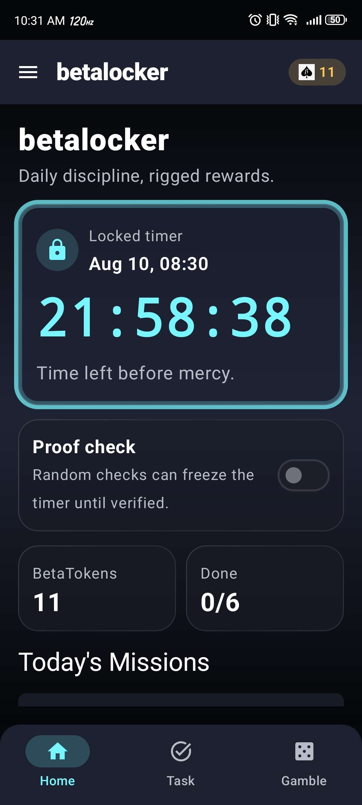
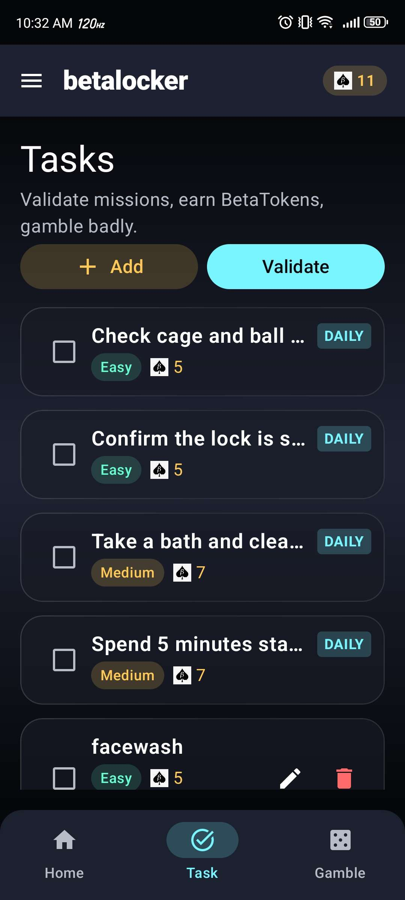
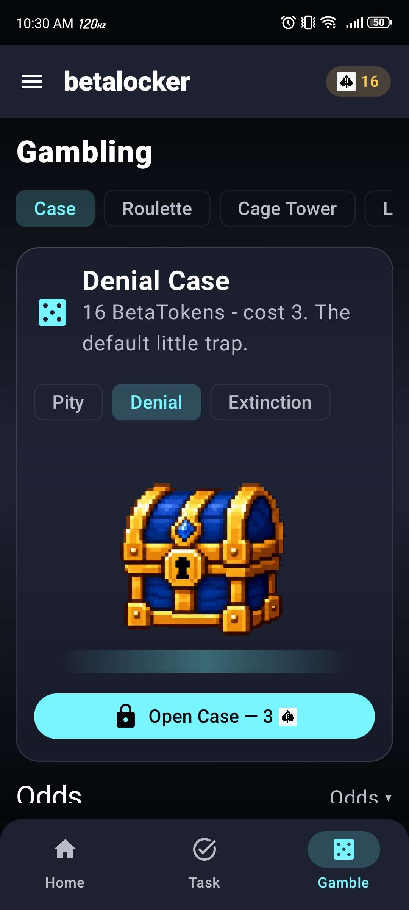
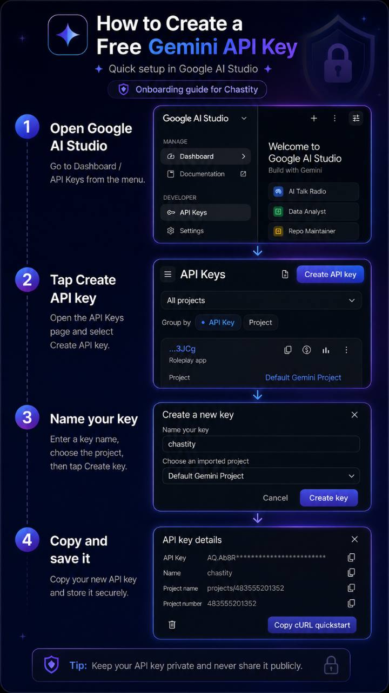

# betalocker

**Yahallo, betas.**

A free, solo chastity app for locked boys who want **the system** to control them — not a real keyholder.  
(Or you’re just too shy to ask someone. That’s fine. The app doesn’t care.)

No payments. No remote keyholder. No “trust me bro” honor system that only works until you get horny.

Just open it. Stay denied.

---

<p align="center">
  
  &nbsp;
  
  &nbsp;
  
</p>

<p align="center">
  
</p>

---

## What it is

**betalocker** is a local-first Android chastity game:

| You do… | The app does… |
|--------|----------------|
| Create daily missions | AI-validates them so you can’t spam trash for tokens |
| Complete real work | Pays **BetaTokens** (once per valid mission / day rules) |
| Spend tokens on gacha & games | **Adds time** more often than it shows mercy |
| Optionally enable proof checks | Freezes the timer until cage proof passes |

If you cheat outside the app, that’s your problem. The system doesn’t care. Stay locked.

---

## Core loop

```text
  Lock timer
      │
      ▼
  Create missions  ──►  Gemini validates (reject spam / too easy)
      │
      ▼
  Complete missions  ──►  Earn BetaTokens
      │
      ▼
  Gamble / Shop  ──►  Sentence goes up (usually) or tiny mercy (rarely)
      │
      ▼
  Optional proof checks  ──►  Fail / refuse  =  frozen timer
```

**Tagline (in-app):** *Daily discipline, rigged rewards.*

---

## Features

### Home — locked timer

- Persistent **lock countdown** with unlock target time  
- **Proof check** toggle: random cage-check photos (AI-verified) can **freeze** the timer until you pass  
- **Privacy mode**: turn photo checks off if you want — you still stay locked  
- Quick stats: **BetaTokens** balance + **Done** mission count for the day  
- **Today’s Missions** snapshot  

### Tasks — earn tokens honestly

- Add your own missions  
- Hit **Validate** — Gemini scores difficulty and rejects garbage  
- Difficulties & rewards (typical):

  | Difficulty | BetaTokens |
  |------------|------------|
  | Easy       | 5          |
  | Medium     | 7          |
  | Hard       | 10         |
  | Hardcore   | 20         |

- Daily missions, draft / rejected states, no free inflation  

### Gambling — stacked against you on purpose

Spend tokens on machines that mostly **extend** the lock:

| Machine     | Cost (BetaTokens) | Vibe |
|-------------|-------------------|------|
| **Case**    | 3                 | Pity / Denial / Extinction chests |
| **Roulette**| 5                 | Spin for sentence pain |
| **Cage Tower** | 6              | Climb until you fall |
| **Lock Drop**  | 5              | Drop and pray |

**Denial Case** is the default little trap: open for **3 BetaTokens**, pull rarity-weighted prizes (mostly more days).

Odds lean hard into **extensions**. Mercy exists so hope hurts more.

### Shop — expensive crumbs of mercy

Spend a pile of tokens for tiny reductions (examples from design):

| Mercy        | Cost   |
|--------------|--------|
| −2 hours     | 40 BT  |
| −4 hours     | 80 BT  |
| −6 hours     | 115 BT |

Yes, farming missions for hours of freedom is the point. The math is not your friend.

### Widget

Home-screen widget tracks **hours denied** so you don’t forget what you are.

### Other (in app)

- Guided **onboarding tour** (ends with Gemini setup in Settings)  
- **History** of what the app did to you  
- **Settings**: API key, model, privacy / proof, reset, **replay tutorial**  
- Local **Room** database — timer, missions, tokens, and rules live **on device**  
- Optional **Prejac Training** and future **Censor Vault** on the roadmap  

---

## Screenshots

### Home

Locked timer, proof toggle, tokens, daily progress.


### Tasks

Validate missions, earn BetaTokens, don’t farm nonsense.


### Gambling — Denial Case

Open cases. Cry about the odds.


### Widget

Hours denied, always visible.


---

## Getting started

### Requirements

- Android phone (**min SDK 26** / Android 8.0+)  
- Internet only when talking to **Gemini** (validation / proof)  
- A free **Google AI Studio** API key (see below)  

### Install

1. Build from source with Android Studio / Gradle, **or** install a release APK if you were given one.  
2. Open **betalocker**.  
3. Set your initial lock duration when prompted.  
4. Follow the in-app tour.  
5. Paste your **Gemini API key** in **Settings** (tour step).  
6. Create missions → **Validate** → complete them → waste tokens on cases.  

Package / app id: `com.roulete.chastity`  
Version (dev): `0.1.0`

---

## How to create a free Gemini API key

Mission validation and optional photo proof checks use **Google Gemini**.  
You need your **own free API key** from **Google AI Studio**. The app never ships with a shared key.

### Visual guide



### Step-by-step

1. **Open Google AI Studio**  
   - Go to: [https://aistudio.google.com/](https://aistudio.google.com/)  
   - Sign in with a Google account.  
   - Open the menu → **Dashboard** / **API Keys** (under Developer).

2. **Create API key**  
   - On the **API Keys** page, tap **Create API key**.  
   - You can create a key for an existing project or the default Gemini project.

3. **Name your key**  
   - Give it a clear name (e.g. `chastity` or `betalocker`).  
   - Choose the project if asked.  
   - Tap **Create key**.

4. **Copy and save it**  
   - Copy the key **once** (you may not see the full value again easily).  
   - Store it somewhere private.  
   - In the app: **Menu → Settings → Gemini API key** → paste → save.

### Tips & safety

- **Free tier** is enough for personal mission validation and occasional proof checks.  
- **Keep the key private.** Do not post it in Discord, screenshots of Settings, GitHub, or group chats.  
- If a key leaks, **delete it** in AI Studio and create a new one.  
- If validation fails, check: wrong key, quota, model name in Settings, or network.  
- The app stores the key in **local preferences** on your device — not in a public backend.

### What Gemini is used for

| Feature | Role of Gemini |
|---------|----------------|
| Mission **Validate** | Rejects spam / too-easy junk; helps assign difficulty |
| **Proof check** photos | Optional AI cage-check; fail/refuse can freeze the timer |
| Timer / tokens / odds | **Not** decided by Gemini — the **Android app** owns all game state |

---

## Economy cheatsheet

**Earn**

- Easy / Medium / Hard / Hardcore missions → **5 / 7 / 10 / 20** BetaTokens  

**Spend**

- Case **3** · Roulette **5** · Cage Tower **6** · Lock Drop **5**  
- Shop mercy: **40 / 80 / 115** for −2h / −4h / −6h  

**Design intent:** tokens are for **bad decisions**, not freedom.

---

## Privacy & philosophy

- **Local-first:** lock time, missions, history, and tokens live on your phone.  
- **No real money** in the loop.  
- **No required keyholder** — the system is the keyholder.  
- **Proof checks are optional** (privacy mode). Turning them off does **not** unlock you.  
- Photos for proof are only sent when **you** enable checks and submit — use Gemini under **your** API key.  
- Cheating IRL is always possible. The app is for people who want friction, not for cops.

---

## Build from source (developers)

```bash
# From repo root
./gradlew :app:assembleDebug
# or on Windows
gradlew.bat :app:assembleDebug
```

- Kotlin + Jetpack Compose  
- Room for persistence  
- Gemini over HTTPS with your key  
- Debug builds may enable extra tools (`ENABLE_DEBUG_TOOLS`)  

See `PLAN.md` in the repo for architecture, Room plan, and roadmap (Censor Vault, richer missions, etc.).

---

## Disclaimer

This is an **adult consensual fetish / chastity self-management game**.  
Not medical advice. Not a real locksmith. Not a substitute for communication, safewords, or real-life responsibility.  
If something stops being fun or safe, **stop**. The app will not call an ambulance for your ego.

---

## Stay locked

You create the missions.  
The AI rejects the easy outs.  
The cases are mean on purpose.  
The timer keeps running.

**No payments. No keyholder required.**  
Open it. Stay denied.

*If you cheat, that’s your problem. The system doesn’t care.*
